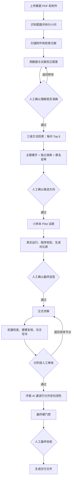

# Remit 是怎么把一道数模题做完的？

做过数学建模的人大概都有这种感觉：真正麻烦的，往往不是“找一个模型”这么简单。
读题会读偏，附件可能藏着坑，文献里的方法不一定能落地，代码跑通了也不代表结果可信，
最后还得把一堆零散结果写成一篇能交的论文。

Remit 想做的，就是把这条很长的路拆清楚。它让不同的 Agent 分工协作，把每一步的
依据、代码和结果都留下来；到了真正影响方向的地方，再停下来交给人确认。

> 简单说：AI 负责认真干活，人始终握着方向盘。

Remit 目前仍处于 `0.1.x` 阶段。下面介绍的是项目当前已经建立的主流程，其中模型评审组
可以按需开启；文献全文能否获取，则会受到网络、开放获取状态和接口配置的影响。

## 先看一眼完整流程



## 1. 先把题读明白，不急着建模

用户先上传赛题 PDF 和数据附件。Coordinator 会提取题目标题、背景和每个小问，并尽量
保留小问原文，不让后续返修把原题越改越远。

如果 PDF 里有流程图、坐标图、表格截图或者扫描页，Remit 还会把这些图像内容补充成
可建模的文字信息。接着，它会为每个小问整理出目标、输入数据、决策变量、约束、预期
输出、前后依赖、主要风险和验证要求。

这一步的重点不是“立刻给答案”，而是先把我们到底要解决什么说清楚。

## 2. 一边看附件，一边查文献

题目拆开以后，Remit 会同时做两件事。

第一件事是扫描附件。数据侦察模块会快速查看文件结构、字段、样本规模、缺失值和质量
风险，先弄清楚手里到底有什么数据，而不是只看题面猜。

第二件事是查文献。系统会按小问生成英文检索词，优先通过 OpenAlex 检索，必要时使用
Crossref 兜底，然后完成去重、标题摘要初筛和少量全文精读。真正有用的信息会被整理成
“方法卡”，里面写清楚：这篇文献解决了什么问题、用了什么方法、适用条件是什么、原文
证据在哪里。

文献不会因为“搜到了”就自动进入论文。后面的代码必须验证它确实影响了建模方案，
最终才会进入引用台账。

## 3. 用真实证据校正题意

第一次读题难免会有偏差，所以 Remit 会拿附件画像和文献证据，再回头检查每个小问的
理解。比如数据里根本没有某个关键字段，或者样本结构不支持原先设想的验证方式，这时
就应该及时修正，而不是硬着头皮往下做。

校正后的题意会保存成结构化文件，并停在人工审核节点。你可以直接批准，也可以指出
哪一问理解错了，让系统带着意见重新分析。

## 4. 从本地方法库里找候选，不靠拍脑袋

题意确认后，Remit 会查询项目自带的本地建模方法库。方法库按三级组织：

```text
领域 → 子领域 → 具体方法
```

检索时，系统会把小问原文、校正版分析、数据画像、用户要求和文献摘要放在一起判断。
领域、子领域和具体方法的相关性分别占 `20%`、`30%` 和 `50%`，默认给每个小问找出
最相关的 6 个候选。

这些候选不是“分高就必须用”。每个结果还会附上适用前提、常见失败方式和验证建议，
方便建模 Agent 和人一起判断：它到底适不适合这道题。

## 5. 让不同视角先讨论，再决定往哪走

正式建模时，主 Modeler 会先给出整体方案。如果开启模型评审组，还会有两个独立视角
参与进来：

- 探索员在看不到主方案答案的情况下，另外提出一组候选；
- 盲审员对匿名后的两组方案做整题级评审，重点检查模型上限、验证方式和淘汰路线；
- 主 Modeler 综合题意、数据、文献、方法库和评审意见，形成可执行的候选方案。

机器可以把搜索空间铺开，但最终采用哪条路线，仍然会经过人工确认。

## 6. 先小规模试跑，别一上来就押宝

方向确定后，Remit 不会马上跑完整求解，而是先做一轮 Pilot。

Modeler 会为每个小问安排 2～3 个候选，其中必须包含一个简单、可解释的基线方法。
Coder 按同一份抽样规则和同一个评价指标真实运行这些候选，失败也必须如实记录，不能
编数字凑结果。

程序会检查试跑结果的结构、候选身份和指标是否有效，再把准确率或误差、运行耗时、
是否跑通等信息整理成一张对比表。Modeler 只能从真实跑通的候选中定案，随后再交给人
审核。

这一步很像正式比赛前的小规模排练：先花较小的成本排除明显不合适的方案，后面才不容易
走弯路。

## 7. 正式求解：代码、结果和文字一起过关

最终选型通过后，工作流进入正式求解。每个小问都会按下面的顺序走一遍：

1. Coder 编写代码并真实运行，保存数值结果和图表；
2. 机器检查产物是否齐全，数字是否有限，验证、稳健性和图表是否达到要求；
3. Modeler 根据真实运行证据复核方案，必要时提出返修并要求重新运行；
4. Writer 只使用已经验证过的结果撰写论文段落；
5. 人工审核这一问的代码、结果和文字，再决定继续还是退回。

如果某一步没过，Remit 会保留已经完成的文件，并退回到具体节点处理，不需要把整项任务
从头再跑一遍。

## 8. 最终交付前，再做一次“大检查”

所有小问和结构章节完成后，Remit 会先把内容合并成完整论文。评委 AI 会从摘要、建模
合理性、求解与验证、写作规范和创新性五个方面通读打分，并对最薄弱的章节给出具体修改
意见。Writer 可以据此定向重写，但不能改动真实计算得到的数值结论。

接下来是最终硬门禁：检查章节是否齐全、字数是否合理、有没有占位符、图片是否可用，
以及交付文件能不能正确生成。全部通过后，任务会停在最后一个人工验收节点。

你确认没有问题，Remit 才会生成最终交付文件。

## 这支 Agent 小队里，谁负责什么？

| 角色 | 主要工作 |
| --- | --- |
| Coordinator | 忠实读题、拆分小问、整理结构化任务 |
| Research | 扫描附件、检索文献、提取方法卡 |
| Modeler | 设计候选模型、安排 Pilot、复核正式结果 |
| Coder | 写代码、真实运行、保存数字和图表 |
| Writer | 把通过检查的结果写成论文内容 |
| Scout / Critic | 独立探索和匿名评审，可按需开启 |
| Human | 在关键节点审批、退回和最终定案 |

## 最后会留下什么？

Remit 不只给出一段聊天回答。每个任务都有独立工作目录，里面会保存题意分析、数据画像、
文献与方法卡、候选模型、Pilot 对比、代码、运行结果、图表、质量报告、论文 Markdown 和
最终文档。

这样做可能比“一键生成答案”多几个步骤，但每个结论从哪里来、代码有没有真跑、哪一步
是谁批准的，都更容易回头检查。对数模这种既看结果、也看过程的任务来说，我们觉得这份
踏实很重要。

